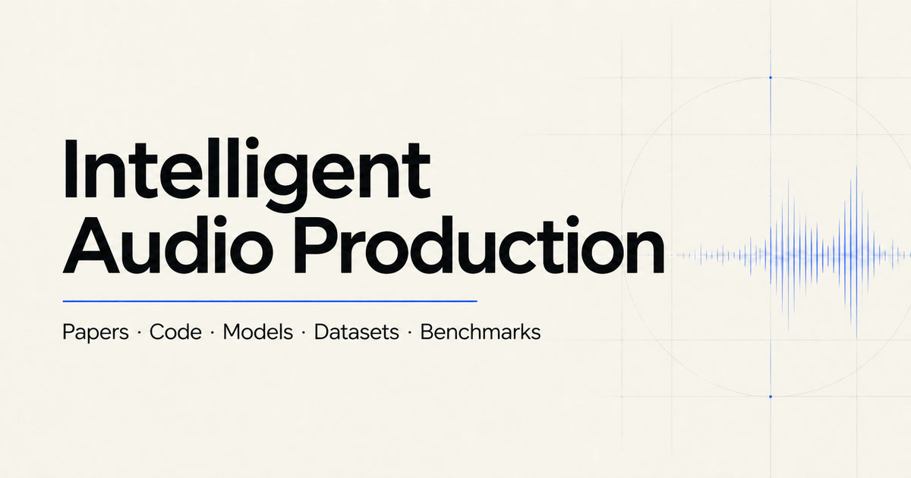

# Intelligent Audio Production Resources

A curated, bilingual research index covering audio effects, differentiable processing, representation learning, automatic mixing, mastering, and evaluation.

[Browse the index](https://meteroad.github.io/intelligent-audio-production-resources/) · [Submit a resource](https://github.com/meteroad/intelligent-audio-production-resources/issues/new/choose) · [Report an issue](https://github.com/meteroad/intelligent-audio-production-resources/issues/new?template=correction.yml)

**71 papers · 40 verified projects · 12 datasets · 2 reference collections**

## What You Can Find

| Collection | Included information |
| --- | --- |
| Papers | Formal venues, paper and DOI links, bilingual summaries, control approaches, track scopes, and associated open resources |
| Projects | Source, checkpoint, inference, training, dataset, license, taxonomy, related-paper evidence, and last-verification dates |
| Datasets | Contents, access conditions, data licenses, scale, and evidence-backed links to papers and projects that use each dataset |
| Reference resources | Field bibliographies and research guides kept separate from runnable implementations |

The index is organized by production task rather than publication year. It currently covers:

- audio effects modeling, estimation, control, transfer, and removal;
- differentiable DSP, effect chains, and processing graphs;
- effect and production-style representation learning;
- automatic, reference-guided, and controllable mixing;
- mastering and remastering;
- benchmarks, metrics, datasets, and reproducibility tools.

Spatial audio is listed as a future extension rather than mixed into the current catalogue.

## Curation Principles

- Paper titles, authors, dates, and links are anchored to primary publication sources where available.
- Formal venues are shown only when publication evidence can be verified.
- Project source, checkpoint, dataset, taxonomy, and license claims are recorded with first-party repository or official-documentation evidence.
- The weekly paper scout proposes reviewable changes; AI-screened candidates and AI Highlight assessments are never published directly.
- AI Highlight and year-normalized citation impact remain separate, documented signals rather than a combined score.
- Every public entry remains open to correction through a structured issue or pull request.

## Contribute

The quickest route is to open a structured request:

- [Add a paper](https://github.com/meteroad/intelligent-audio-production-resources/issues/new?template=paper.yml)
- [Add an open-source project](https://github.com/meteroad/intelligent-audio-production-resources/issues/new?template=project.yml)
- [Add a dataset](https://github.com/meteroad/intelligent-audio-production-resources/issues/new?template=dataset.yml)
- [Correct metadata or report a broken link](https://github.com/meteroad/intelligent-audio-production-resources/issues/new?template=correction.yml)

Please include a primary paper or project URL and enough evidence to verify the requested change. See [CONTRIBUTING.md](CONTRIBUTING.md) before editing catalogue data directly.

## Data

The catalogue is available as version-controlled JSON:

- [`data/papers.json`](data/papers.json)
- [`data/projects.json`](data/projects.json)
- [`data/datasets.json`](data/datasets.json)
- [`data/resources.json`](data/resources.json)

These files drive the public website and can also be used for research tooling or downstream analysis under the repository license.

See [DATA.md](DATA.md) for endpoint URLs, schema versions, field semantics, and migration guidance. Formal contracts are available for [projects v3](schemas/projects-v3.schema.json) and [datasets v1](schemas/datasets-v1.schema.json).

## Automation

The weekly paper scout searches arXiv, screens candidates with a configured language model, proposes conservative AI Highlight assessments, refreshes formal venue, DOI, and citation metadata, validates the data, and opens a reviewable pull request. It does not publish unreviewed candidates directly.

See [automation/README.md](automation/README.md) for configuration and review rules.

## TODO

### Coverage

- [x] Establish a bilingual index for papers, projects, datasets, and reference collections.
- [x] Link datasets to verified papers and open-source projects that use them.
- [ ] Audit historical coverage across effect modeling, parameter estimation, representation learning, mixing, and mastering.
- [ ] Add spatial-audio production tasks after defining a focused taxonomy and inclusion policy.

### Reproducibility and quality

- [ ] Verify installation, inference, training, and checkpoint paths for high-impact repositories.
- [ ] Add structured benchmark metadata for comparing tasks, datasets, metrics, and reported results.
- [ ] Expand automated checks for formal venues, licenses, stale repositories, and broken links.

### Maintenance and access

- [x] Run a weekly paper scout that opens reviewable pull requests instead of publishing automatically.
- [ ] Add a lightweight contributor review process for recurring community submissions.
- [ ] Publish versioned catalogue snapshots and document a stable downstream data interface.

## License

The site code, automation, and original catalogue content in this repository are released under the [MIT License](LICENSE). Linked papers, codebases, models, datasets, and trademarks remain subject to their respective owners' terms.
